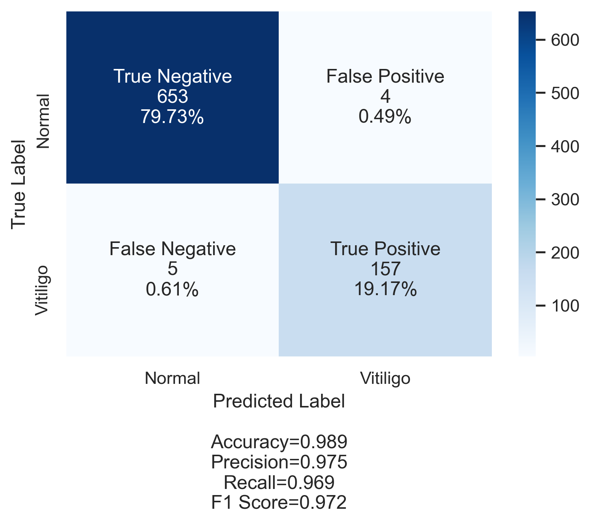

# Vitiligo Predictor

Predicts possible Vitiligo cases using the following features:
- `age` (in years),
- `sex` (`M` for male, `F` for female),
- `history` (`Yes` if any relative has white patches in skin, otherwise `No`)
- `skin type` (either `I`,`II`, `III`, `IV` or `V`)
- `reading` : Light reflectance of epidermis (in lux)
  
### Trained Models

| Model | Accuracy | Precision | Recall | F1-Score |
| :---  | ---:     |  ---:     | ---:   | ---:     |
| `AdaBoostClassifier(n_estimators=100)`* | 98.90% | 97.52% | 96.91% | 97.21% |
| `MLPClassifier(hidden_layer_sizes=(1000,100), max_iter=1000)` | 98.04% | 96.20% | 93.83% | 95.00% |
| `KNeighborsClassifier(n_neighbors=12)` | 96.94% | 96.60% | 87.65% | 91.91% |

`*` Used for prediction



# Install Instructions

1. Install `Pipenv` if not  installed yet
```
$ pip3 install pipenv 
```
2. Clone this repo
```
$ git clone https://github.com/gfabia/vitiligopredictor.git
```
3. Install requirements

```
$ cd vitiligopredictor
$ pipenv shell
$ pip install -r requirements.txt
```

# Usage

## Input Format
Input is passed via the command-line and must be in JSON format. 
Required parameters are: `id` (string), `age` (integer), `sex` (string),  `history` (string), `skin_type` (string) and `reading` (integer).

Example:
```
[{"id": "R89", "age": 19, "sex": "M", "history": "No", "skin_type": "IV", "reading": 75}]
```

Multiple records are allowed. 
For example:

```
[{"id": "R89", "age": 19, "sex": "M", "patches": "No", "history": "No", "skin_type": "IV", "reading_location": "Left Toe and Leg #5", "reading": 75}, {"id": "R90", "age": 85, "sex": "F", "patches": "Yes", "history": "Yes", "skin_type": "IV", "reading_location": "Left Toe and Leg #5", "reading": 76}, {"id": "R91", "age": 90, "sex": "F", "patches": "Yes", "history": "Yes", "skin_type": "IV", "reading_location": "Left Toe and Leg #5", "reading": 76}]
```

## Output Format
Output is printed on STDOUT, also in JSON format. 
If input data is valid then a `prediction` key would be added to each record. `No` means `Normal` and `Yes` means possible Vitiligo case.

For example:

```
{"success": true, "data": [{"id": "R89", "age": 19, "sex": "M", "history": "No", "skin_type": "IV", "reading": 75, "prediction": "No"}]}
```

## Sample Run

```
$ ./vitiligopredictor '[{"id": "R89", "age": 19, "sex": "M", "history": "No", "skin_type": "IV", "reading": 75}]'
{"success": true, "data": [{"id": "R89", "age": 19, "sex": "M", "history": "No", "skin_type": "IV", "reading": 75, "prediction": "No"}]}
```

```
$ ./vitiligopredictor '[{"id": "R89", "age": 19, "sex": "M", "patches": "No", "history": "No", "skin_type": "IV", "reading_location": "Left Toe and Leg #5", "reading": 75}, {"id": "R90", "age": 85, "sex": "F", "patches": "Yes", "history": "Yes", "skin_type": "IV", "reading_location": "Left Toe and Leg #5", "reading": 76}, {"id": "R91", "age": 90, "sex": "F", "patches": "Yes", "history": "Yes", "skin_type": "IV", "reading_location": "Left Toe and Leg #5", "reading": 76}]'
{"success": true, "data": [{"id": "R89", "age": 19, "sex": "M", "patches": "No", "history": "No", "skin_type": "IV", "reading_location": "Left Toe and Leg #5", "reading": 75, "prediction": "No"}, {"id": "R90", "age": 85, "sex": "F", "patches": "Yes", "history": "Yes", "skin_type": "IV", "reading_location": "Left Toe and Leg #5", "reading": 76, "prediction": "No"}, {"id": "R91", "age": 90, "sex": "F", "patches": "Yes", "history": "Yes", "skin_type": "IV", "reading_location": "Left Toe and Leg #5", "reading": 76, "prediction": "Yes"}]}
```

```
$ ./vitiligopredictor '[{"id": "R89", "age": 19, "sex": "M", "history": "No", "skin_type": "VI"}]'
{"success": false, "error": "Column 'reading' is required."}
```

```
$ ./vitiligopredictor '[{"id": "R89", "age": 19, "sex": "M", "history": "Of course", "skin_type": "VI", "reading": 75}]'
{"success": false, "error": "In 'R89', got an invalid datum 'Of course'."}
```

